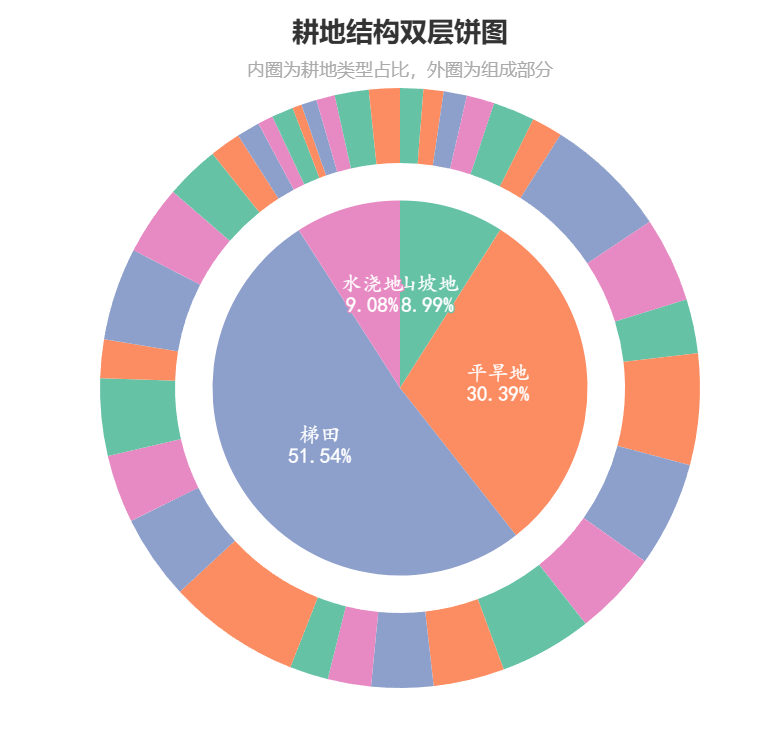

[简介 - pyecharts - A Python Echarts Plotting Library built with love.](https://pyecharts.org/#/zh-cn/intro)





明白了。我将为你完成以下任务：

1. 整理附录3至附录5的Python代码为清晰、可运行的版本，并添加详细注释以便理解。
2. 详细总结PDF中问题1、2、3的建模思路、解决办法与约束条件，并指出这些内容在附录代码中的具体实现方式。
3. 从理论角度评估模型在设计或应用中的不足之处，并提出可能的改进建议。

我完成后会尽快向你汇报，内容将结构清晰、条理分明，便于你后续分析与使用。请稍等片刻。

# 农作物种植策略优化模型：代码整理与建模分析

## 代码整理

### 附录3：基于差分进化的改进遗传算法（DEGA）程序

```python
import numpy as np
import random

# 遗传算法参数设定
POPULATION_SIZE = 100   # 种群规模
NUM_GENERATIONS = 500   # 迭代次数
MUTATION_FACTOR = 0.8   # 差分进化变异因子
CROSSOVER_RATE = 0.8    # 交叉率
EARLY_STOPPING_THRESHOLD = 0.01  # 提前停止阈值

# 假设已经加载地块（land_types）、作物（crop_types）、季节（seasons）、年份（years）等数据
# 例如：land_types = ['A1','A2',...,'F4'], crop_types = ['1_作物A','2_作物B',...], seasons = [1,2], years = range(2024,2031)
# land_data、crop_data、demand_data 等Pandas数据结构中保存相关信息。

# 初始化种群：每个个体由两个决策变量组成：种植面积 x 和二元选择 z
def initialize_population():
    population = []
    for _ in range(POPULATION_SIZE):
        individual = {
            'x': np.zeros((len(land_types), len(crop_types), len(seasons), len(years))),
            'z': np.random.randint(0, 2, (len(land_types), len(crop_types), len(seasons), len(years)))
        }
        # 初始化时，为每个地块随机选择50%或100%的面积种植
        for i, land in enumerate(land_types):
            land_area = land_data.loc[land_data['地块名称']==land, '地块面积'].values[0]
            for k in range(len(crop_types)):
                for j in range(len(seasons)):
                    for t in range(len(years)):
                        individual['x'][i,k,j,t] = random.choice([0.5, 1.0]) * land_area
        population.append(individual)
    return population

# 适应度函数：计算个体收益（减去罚则项）
def calculate_fitness(individual):
    fitness = 0
    penalty = 0
    # 遍历每块地、每种作物、每个季次和年份
    for i, land in enumerate(land_types):
        for k, crop in enumerate(crop_types):
            for j in seasons:
                for t in years:
                    area = individual['x'][i, k, j-1, t-2024]
                    z_val = individual['z'][i, k, j-1, t-2024]
                    # 查找作物价格、成本、产量等信息
                    crop_info = crop_data[crop_data['组合编号']==crop]
                    if not crop_info.empty:
                        price = crop_info['销售单价'].values[0]
                        cost = crop_info['种植成本'].values[0]
                        yield_per_acre = crop_info['亩产量/斤'].values[0]
                        demand = demand_data[demand_data['作物编号']==int(crop.split('_')[0])]['需求量'].values[0]
                        # 计算该作物收益（考虑市场需求限制）
                        profit = min(yield_per_acre * area, demand) * price - cost * area
                        fitness += profit
                    # 约束1：地块总面积限制
                    total_area = individual['x'][i, :, j-1, t-2024].sum()
                    max_area = land_data.loc[land_data['地块名称']==land, '地块面积'].values[0]
                    if total_area > max_area:
                        penalty += 1000  # 违背面积限制的重罚
                    # 约束2：单种作物面积下限约束（若作物被选择种植，则面积至少为地块50%）
                    if area <= 0.5 * max_area and z_val == 1:
                        penalty += 500
                    # 约束3：种植面积与二元变量的关联（若z=0则面积应为0；若z=1则面积≤总地块面积）
                    if area > max_area * z_val:
                        penalty += 1000
    return fitness - penalty

# 差分变异操作：为每个个体生成变异体
def differential_mutation(population):
    new_population = []
    for i, target in enumerate(population):
        # 随机选择三个不同的个体
        indices = list(range(len(population)))
        indices.remove(i)
        r1, r2, r3 = random.sample(indices, 3)
        donor = {'x': np.copy(population[r1]['x']), 'z': np.copy(population[r1]['z'])}
        # 差分变异
        donor['x'] = population[r1]['x'] + MUTATION_FACTOR * (population[r2]['x'] - population[r3]['x'])
        # 保证变异后面积在合理范围内（50%-100%地块面积）
        for idx in range(len(land_types)):
            land_area = land_data.loc[land_data['地块名称']==land_types[idx], '地块面积'].values[0]
            donor['x'][idx] = np.clip(donor['x'][idx], 0.5 * land_area, 1.0 * land_area)
        new_population.append(donor)
    return new_population

# 交叉操作：以一定概率采用突变体的部分面积值
def crossover(target, donor):
    trial = {'x': np.copy(target['x']), 'z': np.copy(target['z'])}
    for i in range(len(land_types)):
        if random.random() > CROSSOVER_RATE:
            trial['x'][i] = donor['x'][i]  # 交叉替换x矩阵对应部分
    return trial

# 选择操作：比较父代和子代适应度，保留更优者
def selection(target, trial):
    return trial if calculate_fitness(trial) > calculate_fitness(target) else target

# 主算法流程：差分进化+遗传操作
def differential_evolution():
    population = initialize_population()
    best_fitness_history = []
    for generation in range(NUM_GENERATIONS):
        new_population = []
        # 迭代更新种群
        for i in range(POPULATION_SIZE):
            donor = differential_mutation(population)[i]
            trial = crossover(population[i], donor)
            selected_ind = selection(population[i], trial)
            new_population.append(selected_ind)
        population = new_population
        # 记录本代最优适应度
        fitness_values = [calculate_fitness(ind) for ind in population]
        best_fitness = max(fitness_values)
        best_fitness_history.append(best_fitness)
        # 提前停止机制：若连续两代最优适应度变化很小则停止
        if generation > 0 and abs(best_fitness_history[-1] - best_fitness_history[-2]) < EARLY_STOPPING_THRESHOLD:
            print(f"Early stopping at generation {generation}.")
            break
        # 可选：打印每代最优值以监控收敛
        print(f"Generation {generation}: Best Fitness = {best_fitness}")
    # 返回最优个体
    return max(population, key=calculate_fitness)

# 运行算法并输出结果
best_solution = differential_evolution()
output_data = []
for i, land in enumerate(land_types):
    for k, crop in enumerate(crop_types):
        for j in seasons:
            for t in years:
                area = best_solution['x'][i, k, j-1, t-2024]
                if area > 0:
                    output_data.append([land, crop, j, t, area])
print(output_data)
```

**说明：**以上代码整理自附录3，加入了必要的变量定义和注释。其中，`initialize_population` 初始化种群时为每个地块随机选择 50% 或 100% 面积；`calculate_fitness` 根据种植决策计算总利润并对违反约束的情况加以重罚；`differential_mutation`、`crossover`、`selection` 分别对应差分变异、交叉和选择操作；`differential_evolution` 为主循环，包含提前停止机制。通过调参和数据输入，可获得问题一的最优种植策略。

### 附录4：引入 CVaR 的 DEGA 程序

```python
# 适应度函数：加入CVaR（条件风险价值）惩罚项
def calculate_fitness_with_cvar(individual, alpha=0.95):
    fitness = 0
    penalty = 0
    losses = []
    for i, land in enumerate(land_types):
        for k, crop in enumerate(crop_types):
            for j in seasons:
                for t in years:
                    area = individual['x'][i, k, j-1, t-2024]
                    z_val = individual['z'][i, k, j-1, t-2024]
                    crop_info = crop_data[crop_data['组合编号']==crop]
                    if not crop_info.empty:
                        # 基准价格、成本、产量
                        base_price = crop_info['销售单价'].values[0]
                        base_cost = crop_info['种植成本'].values[0]
                        base_yield = crop_info['亩产量/斤'].values[0]
                        # 考虑作物价格和成本的年变化趋势及随机波动
                        if '粮食' in crop:
                            price = base_price  # 粮食类价格稳定
                        elif '蔬菜' in crop:
                            price = base_price * (1.05 ** (t - 2023))  # 蔬菜每年上涨5%
                        elif '食用菌' in crop:
                            price_decline = random.uniform(0.01, 0.05)
                            price = base_price * ((1 - price_decline) ** (t - 2023))
                        else:
                            price = base_price
                        cost = base_cost * (1.05 ** (t - 2023))  # 成本每年增长5%
                        yield_per_acre = base_yield * (1 + random.uniform(-0.1, 0.1))  # 产量±10%波动
                        demand = demand_data[demand_data['作物编号']==int(crop.split('_')[0])]['需求量'].values[0]
                        demand = demand * (1 + random.uniform(-0.05, 0.05))  # 需求±5%波动
                        # 计算收益
                        profit = min(yield_per_acre * area, demand) * price - cost * area
                        fitness += profit
                        # 若收益为负则记录损失，用于CVaR计算
                        if profit < 0:
                            losses.append(abs(profit))
                    # 重复附录3中的约束罚则
                    total_area = individual['x'][i, :, j-1, t-2024].sum()
                    max_area = land_data.loc[land_data['地块名称']==land, '地块面积'].values[0]
                    if total_area > max_area:
                        penalty += 1000
                    if area <= 0.5 * max_area and z_val == 1:
                        penalty += 500
                    if area > max_area * z_val:
                        penalty += 1000
    # 计算CVaR：对所有负收益取平均（损失最严重的(1-alpha)部分）
    if losses:
        sorted_losses = sorted(losses)
        index = int(np.ceil((1 - alpha) * len(sorted_losses)))
        cvar = np.mean(sorted_losses[:index])
        penalty += cvar
    return fitness - penalty

# 主算法流程：与附录3类似，只是在适应度计算时调用新函数
def differential_evolution_with_cvar():
    population = initialize_population()
    best_fitness_history = []
    for generation in range(NUM_GENERATIONS):
        new_population = []
        for i in range(POPULATION_SIZE):
            donor = differential_mutation(population)[i]
            trial = crossover(population[i], donor)
            # 选择时使用含CVaR的适应度函数
            ind_selected = trial if calculate_fitness_with_cvar(trial) > calculate_fitness_with_cvar(population[i]) else population[i]
            new_population.append(ind_selected)
        population = new_population
        fitness_values = [calculate_fitness_with_cvar(ind) for ind in population]
        best_fitness = max(fitness_values)
        best_fitness_history.append(best_fitness)
        if generation > 0 and abs(best_fitness_history[-1] - best_fitness_history[-2]) < EARLY_STOPPING_THRESHOLD:
            print(f"Early stopping at generation {generation}.")
            break
        print(f"Generation {generation}: Best Fitness (with CVaR) = {best_fitness}")
    return max(population, key=lambda ind: calculate_fitness_with_cvar(ind))

# 运行含CVaR的算法并输出结果
best_solution_cvar = differential_evolution_with_cvar()
output_data_cvar = []
for i, land in enumerate(land_types):
    for k, crop in enumerate(crop_types):
        for j in seasons:
            for t in years:
                area = best_solution_cvar['x'][i, k, j-1, t-2024]
                if area > 0:
                    output_data_cvar.append([land, crop, j, t, area])
print(output_data_cvar)
```

**说明：**附录4的代码在适应度函数中引入了**条件风险价值（CVaR）**惩罚。具体做法是在计算收益时，对每个个体随机模拟价格、成本和需求的波动（模拟不确定性情境），记录出现负收益（损失）的情况，然后将所有损失的平均值（CVaR）作为罚则加入目标函数。其余算法流程与附录3相同，通过调用 `calculate_fitness_with_cvar` 来保证求解过程中考虑风险因素。

### 附录5：引入相关因素的 DEGA 程序

```python
# 创建作物相关性矩阵：手动设定不同作物之间的替代性/互补性相关度
def create_correlation_matrix():
    n = len(crop_types)
    corr_matrix = np.identity(n)  # 自相关为1
    # 示例：蔬菜类之间相关性设为0.7，粮食类之间设为0.5，其它设为0.2
    for i in range(n):
        for j in range(i+1, n):
            if '蔬菜' in crop_types[i] and '蔬菜' in crop_types[j]:
                corr = 0.7
            elif '粮食' in crop_types[i] and '粮食' in crop_types[j]:
                corr = 0.5
            else:
                corr = 0.2
            corr_matrix[i, j] = corr_matrix[j, i] = corr
    return corr_matrix

# 适应度函数：加入CVaR和相关性因素
def calculate_fitness_with_cvar_and_correlation(individual, corr_matrix, alpha=0.95):
    fitness = 0
    penalty = 0
    losses = []
    for i, land in enumerate(land_types):
        for k, crop in enumerate(crop_types):
            for j in seasons:
                for t in years:
                    area = individual['x'][i, k, j-1, t-2024]
                    z_val = individual['z'][i, k, j-1, t-2024]
                    crop_info = crop_data[crop_data['组合编号']==crop]
                    if not crop_info.empty:
                        base_price = crop_info['销售单价'].values[0]
                        base_cost = crop_info['种植成本'].values[0]
                        base_yield = crop_info['亩产量/斤'].values[0]
                        # 相关性影响：用每种作物与其他作物平均相关度来调整价格和成本
                        price_corr = 1 + corr_matrix[k].mean()
                        cost_corr = 1 + corr_matrix[k].mean()
                        if '粮食' in crop:
                            price = base_price * price_corr
                        elif '蔬菜' in crop:
                            price = base_price * (1.05 ** (t - 2023)) * price_corr
                        elif '食用菌' in crop:
                            price_decline = random.uniform(0.01, 0.05)
                            price = base_price * ((1 - price_decline) ** (t - 2023)) * price_corr
                        else:
                            price = base_price * price_corr
                        cost = base_cost * (1.05 ** (t - 2023)) * cost_corr
                        yield_per_acre = base_yield * (1 + random.uniform(-0.1, 0.1))
                        demand = demand_data[demand_data['作物编号']==int(crop.split('_')[0])]['需求量'].values[0]
                        demand = demand * (1 + random.uniform(-0.05, 0.05))
                        profit = min(yield_per_acre * area, demand) * price - cost * area
                        fitness += profit
                        if profit < 0:
                            losses.append(abs(profit))
                    # 同样的约束罚则
                    total_area = individual['x'][i, :, j-1, t-2024].sum()
                    max_area = land_data.loc[land_data['地块名称']==land, '地块面积'].values[0]
                    if total_area > max_area:
                        penalty += 1000
                    if area <= 0.5 * max_area and z_val == 1:
                        penalty += 500
                    if area > max_area * z_val:
                        penalty += 1000
    # CVaR惩罚
    if losses:
        sorted_losses = sorted(losses)
        index = int(np.ceil((1 - alpha) * len(sorted_losses)))
        cvar = np.mean(sorted_losses[:index])
        penalty += cvar
    return fitness - penalty

# 主算法流程：初始化相关性矩阵后与CVaR函数结合求解
def differential_evolution_with_correlation():
    population = initialize_population()
    corr_matrix = create_correlation_matrix()
    best_fitness_history = []
    for generation in range(NUM_GENERATIONS):
        new_population = []
        for i in range(POPULATION_SIZE):
            donor = differential_mutation(population)[i]
            trial = crossover(population[i], donor)
            ind_selected = trial if calculate_fitness_with_cvar_and_correlation(trial, corr_matrix) > calculate_fitness_with_cvar_and_correlation(population[i], corr_matrix) else population[i]
            new_population.append(ind_selected)
        population = new_population
        fitness_values = [calculate_fitness_with_cvar_and_correlation(ind, corr_matrix) for ind in population]
        best_fitness = max(fitness_values)
        best_fitness_history.append(best_fitness)
        if generation > 0 and abs(best_fitness_history[-1] - best_fitness_history[-2]) < EARLY_STOPPING_THRESHOLD:
            print(f"Early stopping at generation {generation}.")
            break
        print(f"Generation {generation}: Best Fitness (with Correlation) = {best_fitness}")
    return max(population, key=lambda ind: calculate_fitness_with_cvar_and_correlation(ind, corr_matrix))

# 运行含相关性因素的算法并输出结果
best_solution_corr = differential_evolution_with_correlation()
output_data_corr = []
for i, land in enumerate(land_types):
    for k, crop in enumerate(crop_types):
        for j in seasons:
            for t in years:
                area = best_solution_corr['x'][i, k, j-1, t-2024]
                if area > 0:
                    output_data_corr.append([land, crop, j, t, area])
print(output_data_corr)
```

**说明：**附录5的代码在附录4基础上引入了作物之间的相关性分析。函数 `create_correlation_matrix` 手动给出作物间的相关性系数矩阵（反映替代性或互补性）；`calculate_fitness_with_cvar_and_correlation` 则在计算收益时将相关性因素考虑进价格和成本（例如用相关度加权影响价格），同时保留CVaR惩罚部分。最后的差分进化主流程与前两部分相似，只是适应度函数替换为包含相关性和CVaR的版本。

## 建模分析总结

### 问题1：利润最大化模型

+ **模型目标：** 目标函数是**未来七年（2024-2030年）总利润最大化**，即所有地块、季次和作物的销售收入（按亩产和市场需求计算）减去种植成本的总和。在需求超过产量时取产量的实际值，否则取需求上限；对供大于求的情况，还可设置降价因子（题目中设β=0或0.5）以反映价格下降影响。
+ **决策变量：** 设 $x_{ijkt}$ 表示第 $t$ 年第 $j$ 季在第 $i$ 块地上种植作物 $k$ 的面积（亩），$z_{ijkt}\in{0,1}$ 表示作物 $k$ 是否在该地块种植（1 表示种植，0 表示不种植）。这两个变量可以精细描述每种作物在每块地、每季、每年的种植情况，同时保证模型具有灵活的控制能力。
+ **约束条件：** 共考虑 **12 个关键约束**，主要包括：
  1. **地块面积上限：** 某块地在某年某季用于种植的总面积不能超过该地块的可用面积。
  2. **种植面积下限：** 若某地块种植作物，则该作物面积不得小于该地块总面积的 50%，以避免过度零散种植。
  3. **面积与选择变量关联：** 若$z_{ijkt}=0$（不种植该作物），则$x_{ijkt}=0$；若$z_{ijkt}=1$，则$x_{ijkt}\le$该地块总面积，确保逻辑一致。
  4. **禁止连续重茬：** A、B、C 类地块（每年一季粮食地块）规定不允许连续年份种植同一作物；D、E、F 类地块（可年种两季）规定相邻季和跨年的第二季第一季均不得种同种作物。
  5. **豆类种植要求：** 豆科作物（编号 1,2,3,4,5,17,18,19）每块地 3 年内至少种植一次，用于土壤固氮。
  6. **地块类型限制：** A/B/C 地块每年仅种植一季粮食（编号1~15，除水稻），公式(7)约束第二季面积为 0；D 类地块（灌溉地）年可种一季水稻（编号16）或两季蔬菜（编号17~37） ，且第一季不能种白菜萝卜类（编号35~37）；E 类地块（普通大棚）第一季可种蔬菜但不种白菜萝卜，第二季仅种食用菌（编号38~41）；F 类地块（智能大棚）全年两季均种蔬菜，不允许种白菜萝卜；食用菌只能种在普通大棚第二季。
  7. **种植分散度限制：** 每种作物每季最多在 5 块地同时种植，以避免管理过度分散。
  8. **产量满足需求：** 每季每种作物的实际产量应不低于预期销售量的 90%，确保供给基本充足。

根据上述决策变量和约束，可建立数学模型（例如式(1)~(18)所示）。在此基础上，采用基于差分进化的改进遗传算法（DEGA）求解：程序以种群方式并行探索，结合差分变异、交叉和遗传选择机制，计算多个情境下的最优解。文中分别针对**滞销情境**（需求无法完全售出）和**50%降价情境**进行了求解，得到 2024–2030 年的最优种植方案。结果显示，在双情境下年利润均呈稳步增长，累计利润在降价情境下约为 2.1534×10^7 元，高于滞销情境的 1.7926×10^7 元。

### 问题2：CVaR 风险控制模型

+ **模型改进：** 在问题一模型的基础上，引入价格、产量、成本、需求等因素的不确定性（例如假设小麦和玉米销售量年增长率为 5%~10%等模拟）。这些不确定参数被纳入决策过程中，相应地加入问题一已有的约束条件中。
+ **CVaR 目标：** 为平衡收益和风险，引入**条件风险价值（CVaR）**优化方法。新的目标函数同时考虑总利润最大化和 CVaR 风险控制：即在最大化期望利润的同时，通过惩罚最坏情况下的损失来控制风险。在代码中，通过 `calculate_fitness_with_cvar` 函数将 CVaR 作为罚则添加到适应度计算中：对每个个体，在模拟各种随机情境（价格、成本、产量、需求波动）下记录所有负收益，然后取最差 (1-α) 比例损失的平均值作为 CVaR，将其加入惩罚项。
+ **求解方法：** 使用改进后的 DEGA 算法（参考附录4代码），在每次选择时以考虑 CVaR 的适应度评估个体优劣。最终得到了适用于所有不确定情景的最优种植方案。对比结果显示，考虑不确定性后每年利润略有下降，七年总利润约为 1.7098×10^7 元，低于问题一中未考虑风险时的 1.7926×10^7 元。这表明引入 CVaR 有效控制了尾部风险，但也牺牲了一定收益。

### 问题3：相关性增强的 CVaR 模型

+ **相关性分析：** 先对不同作物的种植面积时间序列进行 Spearman 相关性分析（使用附录5中构建的“相关性矩阵”）。结果表明，蔬菜类作物之间互为较强可替代性（高相关系数），粮食类作物之间中等相关，其余作物相关性较低。此外，对预期销售量、销售价格和种植成本等变量也进行 Spearman 相关性计算，确定三者间的关联趋势。
+ **模型扩展：** 在问题二的 CVaR 模型中，逐步加入农作物之间的可替代性/互补性约束，以及预期销售量、价格与成本之间的相关性约束。这意味着模型不仅在目标函数中加入相关性影响（如附录5代码对价格和成本进行相关性调整），还可加入实际应用中的相互关系约束（如某些作物面积之和限制等）。在文中实现中，主要通过修改适应度函数来综合考虑相关性影响，使用附录5给出的相关系数矩阵来调整收益计算。
+ **求解与结果：** 调用包含相关性和 CVaR 的 DEGA 算法（参考附录5代码）进行求解。结果显示，加入作物相关性约束后，各年的利润显著提高。例如，分析结果指出小麦和茄子的利润最高，七年总利润提升至约 2.1799×10^7 元。这表明考虑替代性/互补性和变量相关性约束有助于优化种植结构，提高整体收益。最后还对模型进行了鲁棒性分析，发现加入不确定性因素对总利润的影响较小，表明该模型较为稳健。

## 模型评估与改进建议

+ **算法效率与多样性：** 本文采用的 DEGA 结合了差分进化与遗传算法思想，通过变异和交叉操作生成新个体，并采用精英选择策略。这一方案在全局搜索上具有一定优势，但可能存在**早熟收敛**风险，即种群过早聚焦于局部最优而丧失多样性。附录3代码中的提前停止机制虽然可避免无效迭代，但若阈值过大可能过早终止，使结果不够稳定。建议可引入多种群策略或动态变异率以保持种群多样性，或者采用自适应交叉变异概率来平衡探索与利用。另外，**混合算法**（如将局部搜索嵌入群体算法）也能提高收敛精度和速度。
+ **风险处理：** 文中仅使用单一 CVaR 指标量化风险，且是在适应度计算中随机采样进行估计。这样做可能导致**估计不稳定**，尤其种群中每个个体的 CVaR 计算都依赖于随机样本。改进措施可包括：使用更多情景模拟或蒙特卡罗方法精确估计 CVaR，或者将 CVaR 引入目标函数成为多目标优化问题（同时优化期望收益与风险度量）；此外，也可考虑**鲁棒优化**框架，直接对参数不确定集进行优化，使解对波动具有更强的鲁棒性。
+ **相关性与互补性建模：** 目前通过人为设置相关性矩阵并在收益计算中简单调整价格和成本，这是经验性较强的做法。真实情况下，作物间的互补与替代可能涉及更复杂的经济和生态关系。改进建议可基于实际数据估计作物替代弹性，建立线性或非线性约束（例如限定某两作物面积之和），而非仅仅在适应度中加权。此外，考虑**空间和轮作**因素（如轮作收益增益、病虫害传播等）也能更合理地体现作物互补效应。
+ **实际约束的增加：** 模型目前未考虑一些现实限制，如水资源、肥料供应、劳动投入等。未来可在约束条件中加入水耗、成本预算、机械作业能力等多种约束，以反映实际生产条件。比如针对灌溉地块的用水量约束、机耕投入限额等，都可使优化结果更具实际意义。
+ **多目标优化和敏感性：** 除利润和风险，农户可能关心社会效益（如粮食安全）、环境指标（如碳排放）等。可将模型扩展为多目标优化，采用如Pareto前沿等技术平衡不同目标。此外，可对模型参数（如价格、产量预测）进行敏感性分析，评估方案随环境变化的稳定性，进一步增强策略的适用性和推广性。

综上所述，该模型通过 DEGA 结合 CVaR 和相关性因素，较全面地考虑了收益和风险。但仍可通过改进算法策略、增强情景模拟、丰富约束条件等手段进一步提升模型的可靠性和现实适应性。未来工作可沿着上述思路展开，使优化结果更贴近实际农业生产需求。