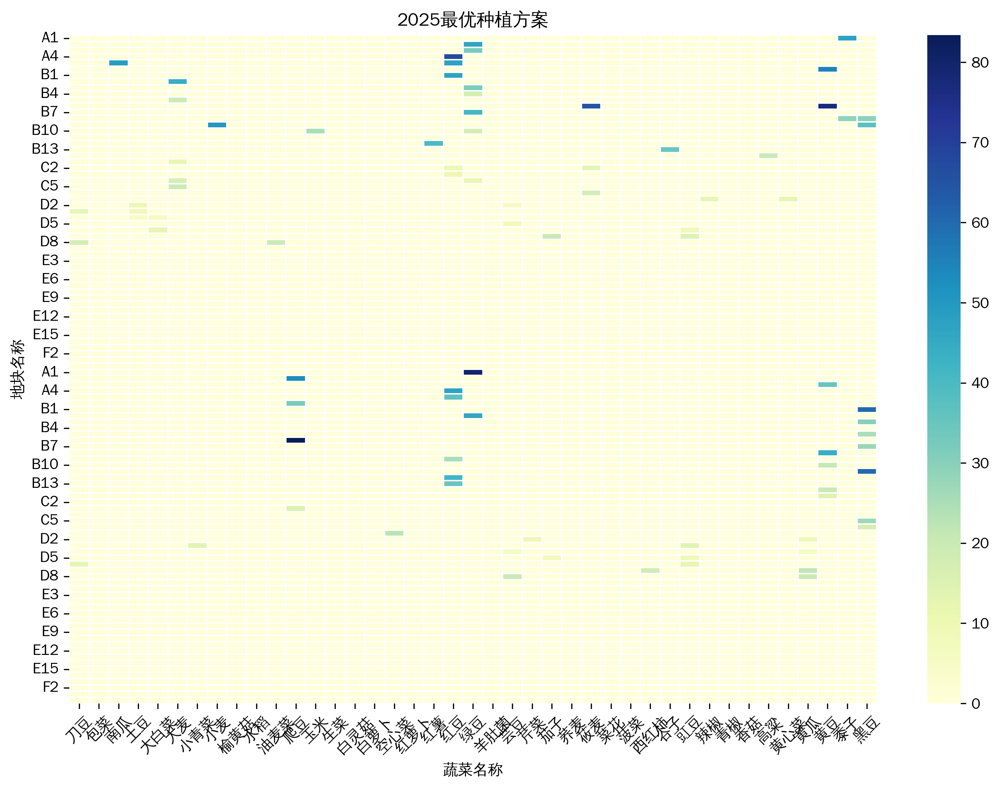
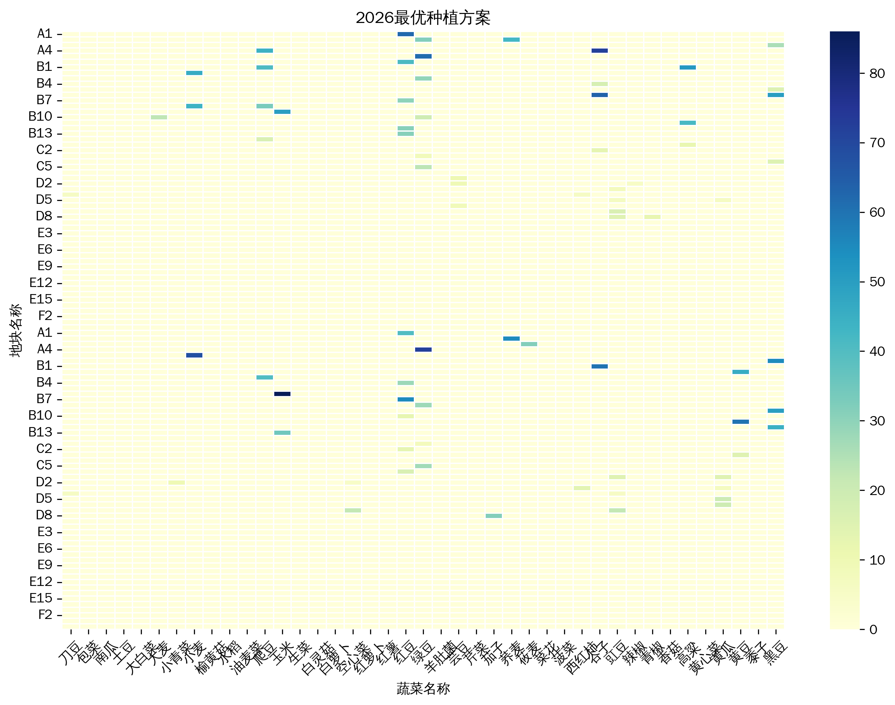
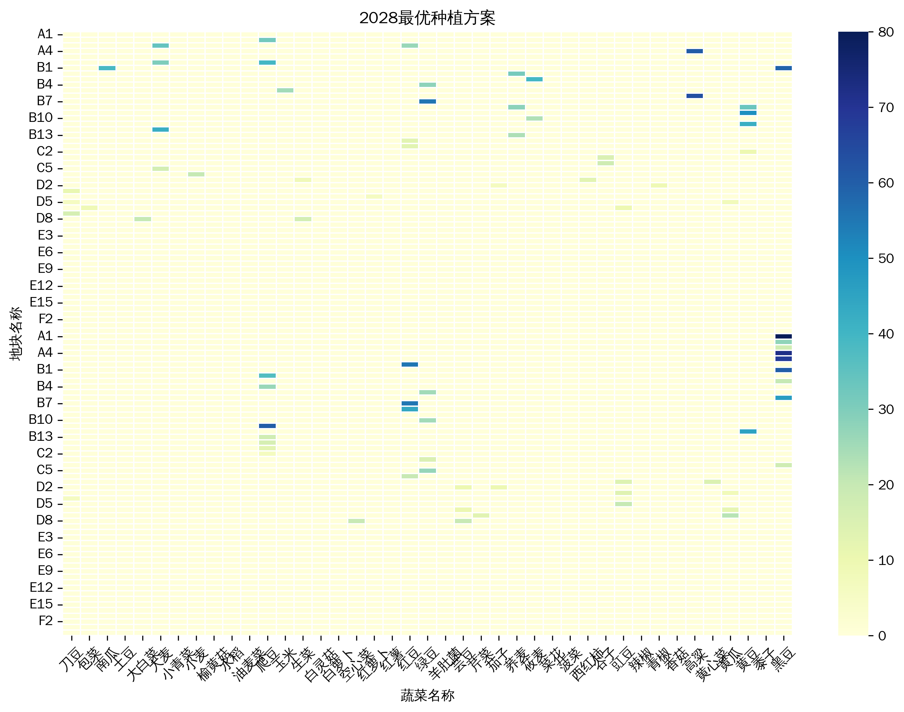
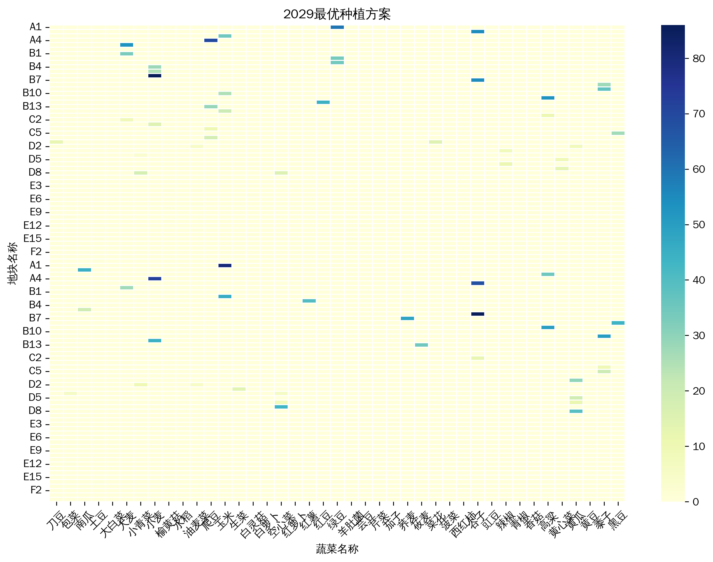

## 各个表格的数据展示

```python
(base) PS E:\education\math\MathematicalModelingReproduction\ykx_workdir> python
Python 3.12.7 | packaged by Anaconda, Inc. | (main, Oct  4 2024, 13:17:27) [MSC v.1929 64 bit (AMD64)] on win32
Type "help", "copyright", "credits" or "license" for more information.
>>> import pandas as pd
>>> 
>>>
>>> # --- 文件和工作簿(Sheet)名称定义 ---
>>> # 请确保这两个Excel文件与本脚本文件放置在同一个文件夹下
>>> file_1 = './C/附件1.xlsx'
>>> file_2 = './C/附件2.xlsx'
>>>
>>> # 附件一的两个工作簿(Sheet)名称
>>> sheet_land_info = '乡村的现有耕地'
>>> sheet_corp_info = '乡村种植的农作物'
>>> # 附件二的两个工作簿(Sheet)名称
>>> sheet_planting_2023 = '2023年的农作物种植情况'
>>> sheet_stats_2023 = '2023年统计的相关数据'
>>> df_land_info = pd.read_excel(file_1, sheet_name=sheet_land_info)
>>> df_land_info.head()                                             
   地块名称  地块类型  地块面积/亩
0    A1   平旱地    80.0
1    A2   平旱地    55.0
2    A3   平旱地    35.0
3    A4   平旱地    72.0
4    A5   平旱地    68.0
5    A6   平旱地    55.0
>>> df_corp_info = pd.read_excel(file_1, sheet_name=sheet_corp_info)
>>> df_corp_info.head()                                             
   作物编号 作物名称    作物类型              种植耕地
0     1   黄豆  粮食（豆类）  平旱地\n\n梯田\n\n山坡地
1     2   黑豆  粮食（豆类）               NaN
2     3   红豆  粮食（豆类）               NaN
3     4   绿豆  粮食（豆类）               NaN
4     5   爬豆  粮食（豆类）               NaN
>>> df_planting_2023 = pd.read_excel(file_2, sheet_name=sheet_planting_2023)
>>> df_planting_2023.head()                                                 
  种植地块  作物编号 作物名称    作物类型  种植面积/亩 种植季次 地块类型
0   A1     6   小麦      粮食    80.0   单季  平旱地
1   A2     7   玉米      粮食    55.0   单季  平旱地
2   A3     7   玉米      粮食    35.0   单季  平旱地
3   A4     1   黄豆  粮食（豆类）    72.0   单季  平旱地
4   A5     4   绿豆  粮食（豆类）    68.0   单季  平旱地
>>> df_status_2023 = pd.read_excel(file_2, sheet_name=sheet_stats_2023)     
>>> df_status_2023                                                     
      序号  作物编号 作物名称  地块类型 种植季次  亩产量/斤  种植成本/(元/亩)  销售单价/(元/斤)
0      1     1   黄豆   平旱地   单季    400         400   2.50-4.00
1      2     2   黑豆   平旱地   单季    500         400   6.50-8.50
2      3     3   红豆   平旱地   单季    400         350   7.50-9.00
3      4     4   绿豆   平旱地   单季    350         350   6.00-8.00
4      5     5   爬豆   平旱地   单季    415         350   6.00-7.50
..   ...   ...  ...   ...  ...    ...         ...         ...
102  103    30   生菜  智慧大棚  第二季   4500        2200   5.40-7.20
103  104    31   辣椒  智慧大棚  第二季   1800        1300  7.20-10.20
104  105    32  空心菜  智慧大棚  第二季  11000        5500   3.60-7.20
105  106    33  黄心菜  智慧大棚  第二季   5400        2750   4.80-6.00
106  107    34   芹菜  智慧大棚  第二季   6000        1200   3.80-5.80

[107 rows x 8 columns]
>>> output_filename = './C/各类农作物总需求量与总成本.xlsx'
>>> final_file = pd.read_excel(output_filename)                        
>>> final_file.head()                          
  作物名称  总需求量/斤  作物总成本/元
0   刀豆   26880    13440
1   包菜    3930     3255
2   南瓜   35100    13000
3   土豆   30000    30000
4  大白菜  150000    60000
>>> result1_1 = './C/附件3/result1_1.xlsx'
>>> pd.read_excel(result1_1).head()
E:\education\conda\Lib\site-packages\openpyxl\worksheet\header_footer.py:48: UserWarning: Cannot parse header or footer so it will be ignored
  warn("""Cannot parse header or footer so it will be ignored""")
  Unnamed: 0 地块名  黄豆  黑豆  红豆  绿豆  爬豆  小麦  玉米  谷子  高粱  黍子  荞麦  南瓜  红薯  莜麦  大麦  水稻  ...  青椒  菜花  包菜  油麦菜  小青菜  黄瓜  生菜   辣椒  空心菜  黄心菜  芹菜  大白菜  白萝卜  红萝卜  榆黄菇  香菇  白灵菇  羊肚菌
0    第\n一\n季  A1 NaN NaN NaN NaN NaN NaN NaN NaN NaN NaN NaN NaN NaN NaN NaN NaN  ... NaN NaN NaN  NaN  NaN NaN  NaN NaN  NaN  NaN NaN  NaN  NaN  NaN  NaN NaN  NaN  NaN
1        NaN  A2 NaN NaN NaN NaN NaN NaN NaN NaN NaN NaN NaN NaN NaN NaN NaN NaN  ... NaN NaN NaN  NaN  NaN NaN  NaN NaN  NaN  NaN NaN  NaN  NaN  NaN  NaN NaN  NaN  NaN
2        NaN  A3 NaN NaN NaN NaN NaN NaN NaN NaN NaN NaN NaN NaN NaN NaN NaN NaN  ... NaN NaN NaN  NaN  NaN NaN  NaN NaN  NaN  NaN NaN  NaN  NaN  NaN  NaN NaN  NaN  NaN
3        NaN  A4 NaN NaN NaN NaN NaN NaN NaN NaN NaN NaN NaN NaN NaN NaN NaN NaN  ... NaN NaN NaN  NaN  NaN NaN  NaN NaN  NaN  NaN NaN  NaN  NaN  NaN  NaN NaN  NaN  NaN
4        NaN  A5 NaN NaN NaN NaN NaN NaN NaN NaN NaN NaN NaN NaN NaN NaN NaN NaN  ... NaN NaN NaN  NaN  NaN NaN  NaN NaN  NaN  NaN NaN  NaN  NaN  NaN  NaN NaN  NaN  NaN

[5 rows x 43 columns]
>>>
```
## 问题一运行结果

```bash
(base) PS E:\education\math\MathematicalModelingReproduction\ykx_workdir> python .\Problem1.py
============================================================
      农作物种植策略优化 - 差分进化遗传算法 (DEGA)
============================================================
✓ 成功加载数据：54个地块，107种作物
✓ 从 '各类农作物总需求量与总成本.xlsx' 加载了 41 条需求记录

--- 问题1 场景1: 超出部分滞销 ---
开始优化场景 1...
第 50/500 代：最佳利润 = 20,453,274.72
在第 51 代停止（停滞 50 代）
优化完成：最终最佳利润 = 20,453,274.72
✓ 结果已保存至 ./C\附件3\result1_1.xlsx (每个年份一个工作表)

--- 问题1 场景2: 超出部分50%价格出售 ---
开始优化场景 2...
第 50/500 代：最佳利润 = 34,009,841.25
第 100/500 代：最佳利润 = 35,420,863.92
第 150/500 代：最佳利润 = 39,463,782.96
第 200/500 代：最佳利润 = 48,239,653.59
第 250/500 代：最佳利润 = 53,638,907.75
第 300/500 代：最佳利润 = 57,064,218.16
第 100/500 代：最佳利润 = 35,420,863.92
第 150/500 代：最佳利润 = 39,463,782.96
第 200/500 代：最佳利润 = 48,239,653.59
第 250/500 代：最佳利润 = 53,638,907.75
第 100/500 代：最佳利润 = 35,420,863.92
第 150/500 代：最佳利润 = 39,463,782.96
第 200/500 代：最佳利润 = 48,239,653.59
第 100/500 代：最佳利润 = 35,420,863.92
第 150/500 代：最佳利润 = 39,463,782.96
第 200/500 代：最佳利润 = 48,239,653.59
第 250/500 代：最佳利润 = 53,638,907.75
第 300/500 代：最佳利润 = 57,064,218.16
第 350/500 代：最佳利润 = 58,845,622.90
第 400/500 代：最佳利润 = 60,076,787.74
第 450/500 代：最佳利润 = 60,841,996.17
第 500/500 代：最佳利润 = 61,213,510.62
优化完成：最终最佳利润 = 61,213,510.62
第 100/500 代：最佳利润 = 35,420,863.92
第 150/500 代：最佳利润 = 39,463,782.96
第 200/500 代：最佳利润 = 48,239,653.59
第 250/500 代：最佳利润 = 53,638,907.75
第 300/500 代：最佳利润 = 57,064,218.16
第 350/500 代：最佳利润 = 58,845,622.90
第 400/500 代：最佳利润 = 60,076,787.74
第 150/500 代：最佳利润 = 39,463,782.96
第 200/500 代：最佳利润 = 48,239,653.59
第 250/500 代：最佳利润 = 53,638,907.75
第 300/500 代：最佳利润 = 57,064,218.16
第 350/500 代：最佳利润 = 58,845,622.90
第 400/500 代：最佳利润 = 60,076,787.74
第 450/500 代：最佳利润 = 60,841,996.17
第 500/500 代：最佳利润 = 61,213,510.62
优化完成：最终最佳利润 = 61,213,510.62
✓ 结果已保存至 ./C\附件3\result1_2.xlsx (每个年份一个工作表)
第 300/500 代：最佳利润 = 57,064,218.16
第 350/500 代：最佳利润 = 58,845,622.90
第 400/500 代：最佳利润 = 60,076,787.74
第 450/500 代：最佳利润 = 60,841,996.17
第 500/500 代：最佳利润 = 61,213,510.62
优化完成：最终最佳利润 = 61,213,510.62
✓ 结果已保存至 ./C\附件3\result1_2.xlsx (每个年份一个工作表)
第 450/500 代：最佳利润 = 60,841,996.17
第 500/500 代：最佳利润 = 61,213,510.62
优化完成：最终最佳利润 = 61,213,510.62
✓ 结果已保存至 ./C\附件3\result1_2.xlsx (每个年份一个工作表)

第 500/500 代：最佳利润 = 61,213,510.62
优化完成：最终最佳利润 = 61,213,510.62
✓ 结果已保存至 ./C\附件3\result1_2.xlsx (每个年份一个工作表)

============================================================

============================================================
============================================================
优化全部完成！
优化全部完成！
场景1最优总利润 (2024-2030): 20,453,274.72 元
场景1最优总利润 (2024-2030): 20,453,274.72 元
场景2最优总利润 (2024-2030): 61,213,510.62 元
场景2最优总利润 (2024-2030): 61,213,510.62 元
============================================================
```

## 地块类型分析


## 热力图绘制

### 2024


### 2025



### 2026



### 2027


### 2028



### 2029



### 2030


